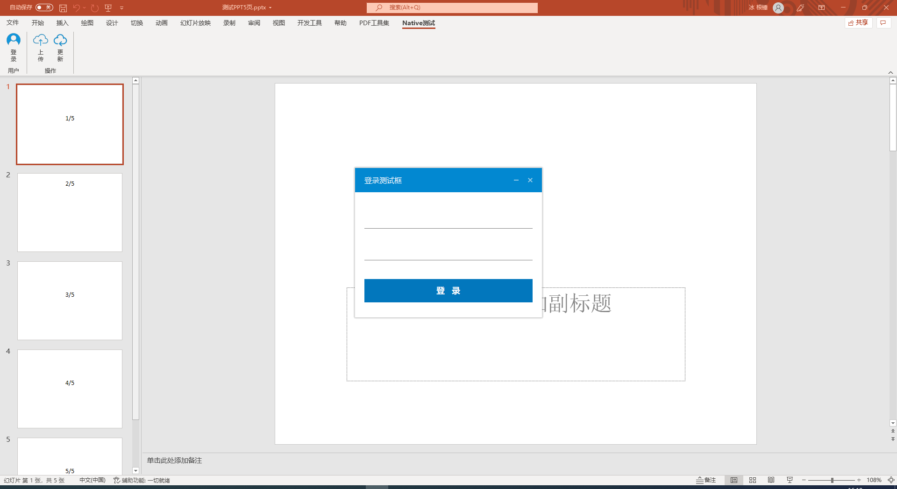
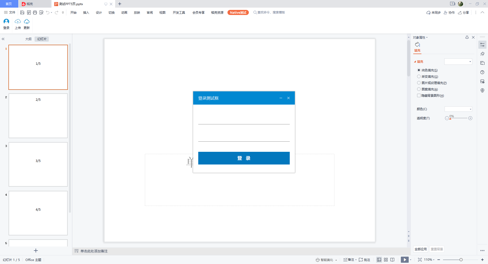

# NativePPTAddin_RealWorld

使用C++/COM编写的PowerPoint插件。

在原[NativePPTAddin](https://github.com/l2m2/NativePPTAddIn)基础上进行改良。

在Office 365上的效果：

在WPS上的效果：

## 开发环境

- Windows 10
- Visual Studio 2019

## thirdparty

- [DuiLib](https://github.com/qdtroy/DuiLib_Ultimate)
- [spdlog](https://github.com/gabime/spdlog)

## 注意事项

- 针对不同位数(x86/x64)的Office版本要编译相对应的插件